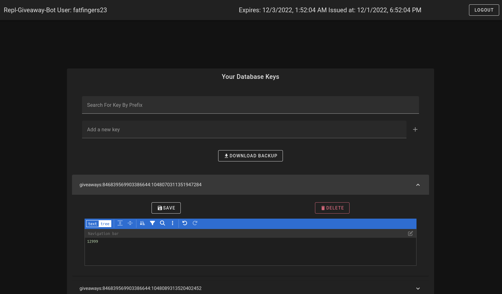

# Replit DB GUI

This is just a simple GUI used for CRUD opertations on a Replt.it db



## Features
* Read Database Keys and filter by prefix
* Edit String and JSON object values with [json-editor-vue](https://www.npmjs.com/package/json-editor-vue)
* Delete Keys
* Add new Keys, then can edit the value
* Download a backup of your server
* (Coming soon?) Update from a backup
* (Coming soon?) Repl Auth with saving databases to a profile

## Technology used
* Vue 3
* Vuetify for styling
* Express to handle all calls to the remote Replit DB

## Production setup

```
npm install
```

### Compiles Vue Project and minifies for production

```
npm run build 
```

### Runs the express node server that hosts an api and the Vue app

```
npm run start:server
```

Now you can visit [http://localhost:3001](http://localhost:3001) for the web app.

### Developer setup

```
npm install
```

## Starting express server
This hosts an API to be able to access a remote Replits db.
The url should be [http://localhost:3001](http://localhost:3001). 
```
npm run start:server
```

## Starting Vite Vue server

Make a copy of `env.local.save` and make sure to set it to the value of your express server.
Most of the time this will be `http://127.0.0.1:3001` with current config. Then run the below to start the Vue project.
```
npm run dev
```

