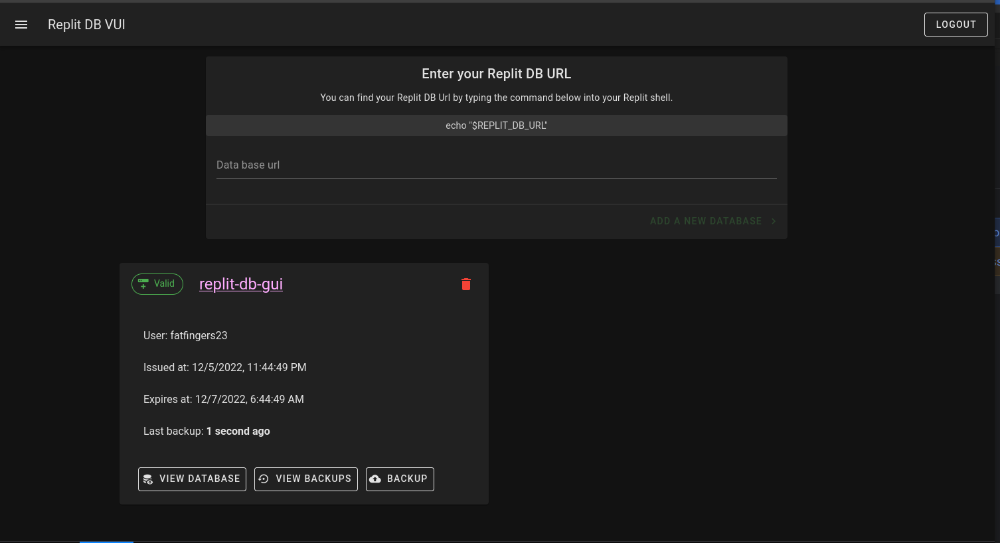

# Replit DB GUI

A web app for managing your Replit DBs.



## Features
* Able to access any Replit's database by it's URL.
* Able to read, add, edit, and delete the database keys with two editors. One simple editor just for simple keys and [json-editor-vue](https://www.npmjs.com/package/json-editor-vue) for your more complex JSON objects.
* Ability to login with your repl and save multiple database urls for quicker managment.
* Once logged in you can create backups, restore, and delete backups!


## Technology used
* Vue 3
* Vuetify for styling
* Express to handle all calls to the remote Replit DB
* [supabase](https://supabase.com) for storing database backups.

## Production setup

```
npm install
```

### Compiles Vue Project and minifies for production

```
npm run build 
```

### Runs the express node server that hosts an api and the Vue app

```
npm run start:server
```

Now you can visit [http://localhost:3001](http://localhost:3001) for the web app.

## Developer setup

```
npm install
```

### Starting express server
This hosts an API to be able to access a remote Replits db.
The url should be [http://localhost:3001](http://localhost:3001). 
```
npm run start:server
```

### Starting Vite Vue server

Make a copy of `env.save` and make sure to set it to the value of your express server.
Most of the time this will be `http://127.0.0.1:3001` with current config. Then run the below to start the Vue project.
```
npm run dev
```

